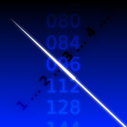
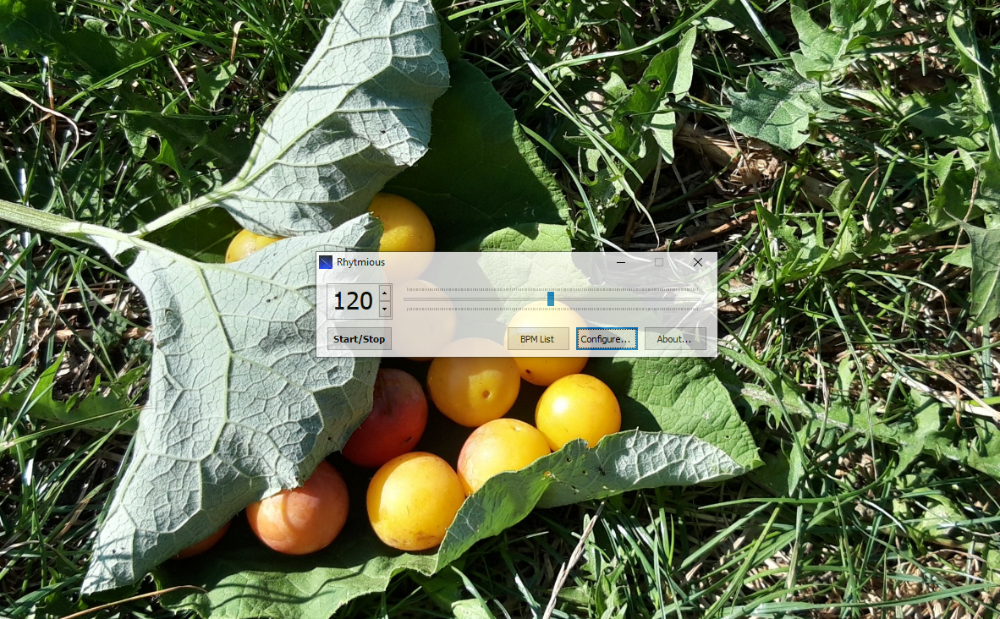

# Rhytmious

Simple and user-friendly metronome for Windows

[Русская версия](README.ru.md)&emsp;/&emsp;[What is this?](#what-is-this) / [Features](#features) / [License](#license) / [Copyright](#copyright)

# What is this?

Rhytmious is a simple and user-friendly metronome for Windows. It supports downbeat and upbeat sounds and even flashing window. It is absolutely portable and does not require to be installed in the system - just download and run!

# Features

* Simple and minimalistic user interface
* BPM values: 40 <==> 216
* Portable. Requires .NET Framework 3.5 only to go
* Freeware. Open Source (written in pure C# with a bit of WinAPI magic)

# License

Rhytmious and its source codes are distributed under the terms of MIT License. See [LICENSE](LICENSE) file for more details.

# Copyright

Copyright &copy; Ivan Movchan &lt;NobootRecord@mail.ru&gt;, 2023

## [nobootrecord.github.io](https://nobootrecord.github.io)

